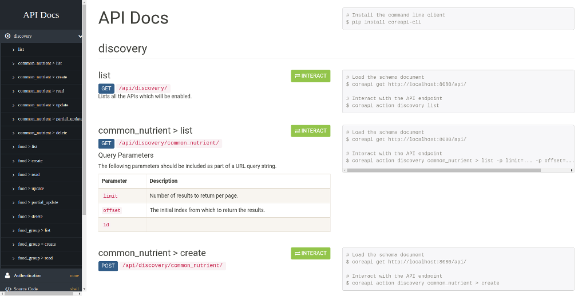

# Project Summary

This is an example project that demonstrates [django-rest-framework-discovery][1] usage. It also leverages `django-filter` for more dynamic filtering and `coreapi` for prettier documentation.

## Requirements

**(Supported)** Installed `docker` and `docker-compose` is needed for this project to run as expected.

**(Unsupported)** If you don't want to install `docker` and friends, you could use `virtualenv` to install the requirements and set environment variables as needed for the project's `settings.py` to function correctly.

## Instructions

Everything is included in this demonstration, no modification should be necessary. Simply run `docker-compose up` and navigate to `http://localhost:8080` in your browser.

Nothing fancy is done here, `urls.py` and `settings.py` are the only files modified from a vanilla state. We also use *whitenoise* in this demonstration to avoid static file management.

If you experience any issues, please open a ticket.

[1]: https://github.com/ztroop/django-rest-framework-discovery
